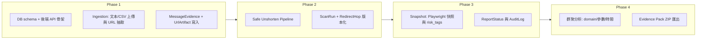

# Shortlink Abuse Evidence Kit（MVP）設計評估與實作計畫

## 一、整體評價與原則對應

| 原則        | 對應                                                                                                      |
| --------- | ------------------------------------------------------------------------------------------------------- |
| **可操作**   | Pipeline 步驟明確（Ingestion → Unshorten → Snapshot → 管理 → 群聚 → 匯出），每步都有對應的資料表與產出，便於實作與驗收。                   |
| **具關聯性**  | Case → MessageEvidence → UrlArtifact → ScanRun → RedirectHop / Snapshot 的關聯清楚；AuditLog 可掛 case_id 統一查詢。 |
| **免費且穩定** | 建議 MVP 技術選型：SQLite、requests 手動追 redirect、Playwright 做快照、本機單機執行，避免雲端與付費 API。                             |

結論：方向正確，只需在以下幾點做小幅補強與取捨，即可進入實作。

---

## 二、使用者觀點：Input / Output

### Input（使用者帶入的內容）

| 類型                    | 說明                                                                       |
| --------------------- | ------------------------------------------------------------------------ |
| **貼上文本**              | 一段或多段文字（例如從社群貼文、聊天紀錄複製），內含一或多個 URL；系統自動抽出所有 URL。                         |
| **上傳 CSV**            | 一筆一則「訊息」的表格，欄位可含：平台、連結、發文者標籤、發文時間、內文、URL 等；系統從中解析 URL 並建立 Evidence。      |
| **每筆 Evidence 的補充欄位** | 平台（platform）、permalink、發文者標籤（可匿名）、訊息時間（message timestamp）、以及**可選**的截圖檔案。 |

一句話：**原始訊息（文本或 CSV）+ 可選截圖與基本 metadata**，即使用者提供的全部 input。

### Output（使用者從工具取得的結果）

| 類型                      | 說明                                                                                   |
| ----------------------- | ------------------------------------------------------------------------------------ |
| **Redirect chain（跳轉鏈）** | 每個短網址的完整追蹤：每一步的 url、status_code、location、resolved_url、fetched_at；多次掃描版本化不覆蓋。         |
| **落地頁快照**               | 最終 URL 的 screenshot（或至少 HTML）、final_url、final_domain、請求的 domain 清單，以及規則產出的**風險標籤**。  |
| **群聚分析結果**              | 依 final_domain 分組的短網址與來源訊息；參數指紋統計；以及「疑似協同」等時間/指紋異常標記。                                |
| **Evidence Pack（ZIP）**  | 可交付的一包證據：原始訊息欄位與截圖、短網址清單與 redirect chain、落地頁快照、SHA-256 清單、精簡 audit log。              |
| **回報追蹤狀態**              | 每筆 URL 或每個 Case 的狀態：unreported / reported / taken_down / unresolved，以及 ticket 編號或備註。 |

一句話：**結構化證據（跳轉鏈、快照、風險標籤）、分析結果（群聚與疑似協同）、以及可交付的證據包與回報狀態**。

---

## 三、Output 呈現格式（交付格式規範）

### 跳轉鏈（Redirect chain）

| 情境      | 格式                                                                 |
| ------- | ------------------------------------------------------------------ |
| **介面內** | 表格：每一行一個 hop，欄位為 url、status_code、location、resolved_url、fetched_at。 |
| **匯出**  | **CSV**（試算表/報告）、**JSON**（程式或證據包內結構化）。                              |

### 落地頁快照（Snapshot）

| 內容   | 格式                                                              |
| ---- | --------------------------------------------------------------- |
| 畫面   | **PNG/JPEG**（screenshot）存檔，路徑記在 DB。                             |
| 頁面內容 | **HTML** 原始檔（.html），路徑記在 DB。                                    |
| 請求網域 | **JSON** 陣列（如 `["domain1.com","domain2.com"]`），存 DB 或證據包。       |
| 風險標籤 | 介面：標籤/徽章；資料：JSON array（如 `["multi_hop","high_tracker_count"]`）。 |

### 群聚分析

| 情境         | 格式                                                      |
| ---------- | ------------------------------------------------------- |
| **介面**     | 列表/樹狀：依 final_domain 分組，底下列短網址與來源訊息；參數指紋表格；「疑似協同」標記或篩選。 |
| **匯出（可選）** | **CSV** 或 **JSON**（依 domain 的群聚表、參數統計表）。                |

### 證據包（Evidence Pack）

| 項目           | 格式                                                                                                                                                                          |
| ------------ | --------------------------------------------------------------------------------------------------------------------------------------------------------------------------- |
| **載體**       | 單一 **ZIP** 壓縮檔。                                                                                                                                                             |
| **目錄結構**     | `messages/`（原始欄位 + 截圖）、`urls/`（短網址清單 + redirect chain 的 CSV/JSON）、`snapshots/`（screenshot 圖檔 + HTML）、`manifest.json`（hash 清單 SHA-256、export 時間等）、`audit.log` 或 `audit.csv`。 |
| **manifest** | **JSON**：檔案路徑與對應 SHA-256、case_id、export_at 等。                                                                                                                               |

### 回報狀態

| 情境     | 格式                                                                             |
| ------ | ------------------------------------------------------------------------------ |
| **介面** | 表格欄位：狀態、ticket 編號、備註。                                                          |
| **匯出** | 證據包內 **CSV** 或 **JSON**（如 `report_status.csv`），或寫入 `manifest.json` 的 metadata。 |

### 格式總覽

| Output 類型 | 介面呈現             | 匯出/儲存格式                                |
| --------- | ---------------- | -------------------------------------- |
| 跳轉鏈       | 表格               | CSV、JSON                               |
| 快照        | 圖 + HTML 連結 + 標籤 | PNG/HTML、request domains 用 JSON        |
| 群聚分析      | 分組列表 + 參數表 + 標記  | 可選 CSV/JSON                            |
| 證據包       | 下載按鈕 → 單一檔案      | **ZIP**（內含 JSON/CSV/圖/HTML + manifest） |
| 回報狀態      | 表格欄位             | CSV 或 JSON（在證據包或單獨匯出）                  |

---

## 四、修改建議（依模組）

### A. Ingestion

- **CSV 格式**：建議預先定義欄位（例如 `platform, permalink, actor_label, posted_at, message_text, url_1, url_2, ...` 或單一 `urls` 欄多筆以分號/換行分隔），文件化範例 CSV，方便「可操作」。
- **原始出現位置**：若從純文本抽取 URL，建議在 `MessageEvidence` 或擴充一欄位存「該則訊息內 URL 的順序」（例如 `url_order` 或於前端顯示時用抽取順序）；您已採「每出現一次一筆 UrlArtifact」且 `message_id` 關聯，同一 message 內多筆 UrlArtifact 的寫入順序即可代表位置，不需再加表。
- **截圖（可選）**：`screenshot_path` 維持 nullable；上傳時約定檔名或 manifest（例如 `{message_evidence_id}.png`）以對應到 `MessageEvidence`。

### B. Safe Unshorten（跳轉鏈）

- **迴圈偵測**：除「最大跳轉次數 10」外，建議同一 `ScanRun` 內若某 `url` 已出現在先前 `RedirectHop`，則視為迴圈並終止、在 `ScanRun.notes` 記 `loop_detected`，避免無意義請求。
- **節制與逾時**：每 hop 設定 timeout（例如 10s）、可選 per-domain 簡單 rate limit（例如同一 domain 間隔 1s），避免被封鎖、提高穩定性。
- **版本化**：維持「同一短網址多次掃描不覆蓋」；`ScanRun` 已用 `run_at` + `url_artifact_id` 區分，不需改模型。

### C. Snapshot（落地頁快照）

- **請求列表**：MVP「只存 domain 清單」合理；`request_domains_json` 建議格式為 `["domain1.com","domain2.com"]`，方便日後規則（例如 tracker 數量）與匯出。
- **風險標籤**：建議在 `Snapshot` 加一欄 `risk_tags`（JSON array，例如 `["multi_hop","suspicious_download","high_tracker_count"]`），由 rule-based 邏輯寫入，方便篩選與匯出。
- **Screenshot/HTML**：儲存「當下收到的」原始 HTML 與截圖即可，不做 sanitize，利於證據完整性；實作上先以 Playwright 一次取得 HTML + screenshot + 請求清單（domain），皆存到本機路徑並寫入 `Snapshot`。

### D. Evidence 管理（Case / Evidence）

- **回報狀態**：目前僅在交付提到「回報狀態欄」；建議在資料模型明確化為「可追蹤的單位」。兩種常見做法：
  - **作法 1（建議）**：新增 `ReportStatus` 表：`(id, case_id, target_type, target_id, status, ticket_ref, notes, updated_at)`，其中 `target_type` 為 `'url_artifact'` 或 `'case'`，`status` 為 `unreported | reported | taken_down | unresolved`。這樣可針對「單一 URL」或「整個 Case」分別追蹤。
  - **作法 2**：僅在 Case 層級一個狀態欄位；實作較簡單但無法對單一 URL 標記。
- **Audit trail**：`AuditLog(actor, action, at, meta_json)` 已足夠；若有多使用者，`actor` 存 user id 或代號即可。建議 `action` 用固定枚舉，例如 `ingest_message | run_scan | run_snapshot | export_pack | update_report_status`。

### E. 群聚（最小分析）

- **依 final_domain 群聚**：以 `Snapshot.final_domain` 為鍵，列出對應的 `UrlArtifact`（或 original_url）與來源 `MessageEvidence`；可做成一個「分析結果」檢視或報表，不需新表，查詢即可。
- **參數指紋**：從 `UrlArtifact.original_url` 與 RedirectHop 的 `resolved_url` 解析 query；統計 utm_*、fbclid、gclid 及自訂 key 的出現頻率與重複值。可產出 JSON/CSV 或寫入一個輕量 `ParameterFingerprint` 表（domain + key 組合 + count）供 MVP 查詢。
- **疑似協同**：規則可訂為「同一 `final_domain` + 同一參數指紋（或無參數）在短時間內（例如 24h）出現超過 N 則訊息」→ 標記「疑似協同」。閾值 N 與時間窗建議放設定檔，方便之後調整。

### F. 交付（匯出與回報）

- **Evidence Pack ZIP 結構**：建議固定目錄結構，例如：
  - `messages/`（原始欄位 + 截圖對照）
  - `urls/`（短網址清單 + redirect_chain CSV/JSON）
  - `snapshots/`（screenshot/html 與 request_domains）
  - `manifest.json`（含 hash 清單 SHA-256、export_at、case_id）
  - `audit.log` 或 `audit.csv`（該 Case 相關 audit 紀錄）
- **回報狀態**：匯出時可帶出目前 `ReportStatus`（若採用上述 `ReportStatus` 表），或至少匯出「未回報 URL 清單」供人工貼到 ticket。

---

## 五、資料模型微調摘要

- **維持不變**：Case, MessageEvidence, UrlArtifact(message_id 關聯), ScanRun, RedirectHop, Snapshot, ExportRun, AuditLog 主體結構。
- **建議新增**：
  - **ReportStatus**：`(id, case_id, target_type, target_id, status, ticket_ref, notes, updated_at)`，用於 per-URL 或 per-Case 回報追蹤。
- **建議擴充**：
  - **Snapshot**：新增 `risk_tags`（JSON array），存規則產出的風險標籤。
- **Optional（若要做參數指紋查詢）**：`ParameterFingerprint(domain, param_key, param_value, count, first_seen)` 或僅在匯出/分析時動態計算不落庫，MVP 可先不建表。

---

## 六、技術選型建議（免費、穩定、可操作）

- **後端**：Python 3.10+，FastAPI 或 Flask（REST API + 背景任務）。
- **資料庫**：SQLite（單檔、免安裝、利於本機與可攜）。
- **Unshorten**：`requests` 手動跟隨 `Location`，每 hop 一筆寫入 `RedirectHop`，加上 max_hops=10 與迴圈偵測。
- **Snapshot**：Playwright（Chromium）取得 final URL 的 HTML、screenshot、request 的 domain 列表；存檔路徑寫入 `Snapshot`。
- **前端**：Streamlit 或簡單 React/Vue 後台（上傳 CSV/貼文、觸發掃描、檢視 Case/Evidence、群聚結果、匯出 ZIP）。
- **排程/佇列**：MVP 可用 in-process 背景執行（例如 FastAPI BackgroundTasks 或 Celery 若之後要分散），避免過度設計。

---

## 七、實作階段建議

- **Phase 1**：資料庫建表（含 ReportStatus、Snapshot.risk_tags）、Ingestion API（貼文 + CSV）、URL 抽取與去重邏輯、寫入 Case / MessageEvidence / UrlArtifact，並寫 AuditLog。
- **Phase 2**：Safe Unshorten 服務（max_hops、loop 偵測、timeout），建立 ScanRun / RedirectHop，不覆蓋既有掃描。
- **Phase 3**：Snapshot 流程（Playwright）、寫入 Snapshot（含 request_domains_json、risk_tags）、ReportStatus CRUD、所有關鍵操作寫 AuditLog。
- **Phase 4**：群聚查詢（final_domain、參數指紋、簡單時間窗）、「疑似協同」標記、Evidence Pack ZIP（含 manifest hash、audit 摘要）、匯出時帶出回報狀態。

---

## 八、風險與注意事項

- **法律與隱私**：actor_label 可匿名化儲存；若含個資，建議加密或存取控管並在文件中說明保留期限。
- **短網址服務政策**：大量請求可能觸發 rate limit 或封鎖，需靠 timeout、間隔與可設定的重試策略提高穩定性。
- **證據完整性**：匯出之 ZIP 內檔案建議皆計算 SHA-256 並列於 manifest，利於事後驗證。

---

若您同意此方向，下一步可從 **Phase 1 的 DB schema 與 Ingestion API** 開始具體設計欄位與 API 規格（例如 CSV 欄位定義、REST 端點清單），再進入實作。